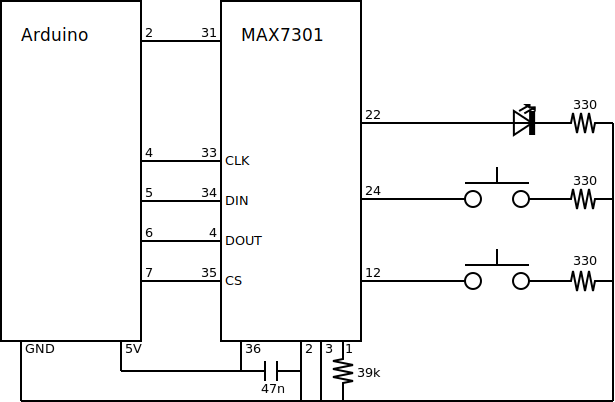

Example sketch
==============

In this sketch_, we demonstrate the different capabilities of the MAX7301. We
connect two buttons and one LED.

- Button 1 is connected to a normal input pin (12).
- Button 2 is connected to an input pin with transition detection (24).
- The LED is connected to pin 22.

   Schema for the test setup, see the MAX7301 datasheet_ for full installation
   instructions.

After compiling and uploading the sketch, connect the Arduino to a USB port and
run the host side script_.

::

    python host.py

This script checks the state of button 1 every second. If it is pressed at the
moment of checking, a short pulse will be send to the LED. Note that if the
button was pressed and released between two consecutive checks, nothing is
registered. Furthermore, if the button is pressed for a longer period, multiple
pulses will be send to the LED.

For button 2, the script checks whether a transition has occurred every second
and sends three short pulses to the LED if this has happened. This transition
will be registered even if the button is pressed and released between two
consecutive checks. Also, the release of the button is registered as a
transition, so the LED will flash upon release of this button as well.

.. _sketch: https://github.com/jfjlaros/max7301/blob/master/device/src/device.ino
.. _datasheet: https://datasheets.maximintegrated.com/en/ds/MAX7301.pdf
.. _script: https://github.com/jfjlaros/max7301/blob/master/host/host.py
